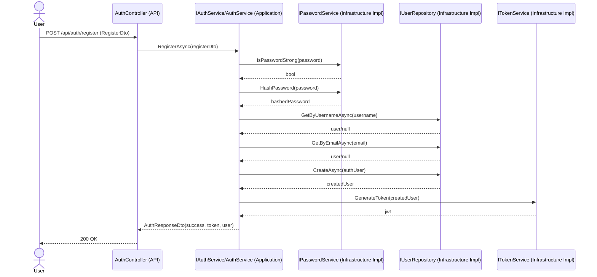
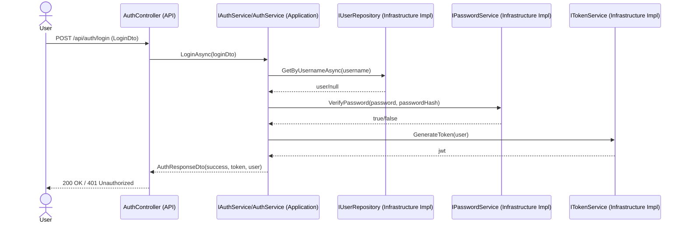

# Authentication Flow (Clean Architecture)

## Layers Involved
- Presentation Layer: `MyFood.Api` (`AuthController`)
- Application Layer: `MyFood.Application` (`IAuthService`, `AuthService`, DTOs, service interfaces)
- Domain Layer: `MyFood.Domain` (`ApplicationUser` entity)
- Infrastructure Layer: `MyFood.Infrastructure` (`UserRepository`, `JwtTokenService`, `PasswordService`)

## Dependency Flow Rule Check
- `MyFood.Api` depends on `MyFood.Application` abstractions.
- `MyFood.Application` depends on interfaces only (`IUserRepository`, `ITokenService`, `IPasswordService`).
- `MyFood.Infrastructure` depends on `MyFood.Application` to implement those interfaces.
- `MyFood.Domain` is used by Infrastructure for persistence model details.

Dependencies point inward to application abstractions, matching Clean Architecture.

## Registration Sequence

## Login Sequence

## Interfaces and Implementations
- `IAuthService` -> `AuthService`
- `IUserRepository` -> `UserRepository`
- `ITokenService` -> `JwtTokenService`
- `IPasswordService` -> `PasswordService`
