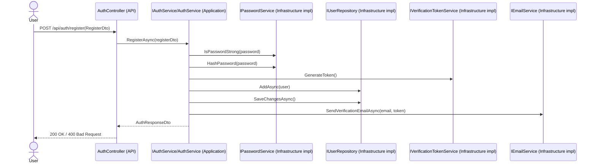
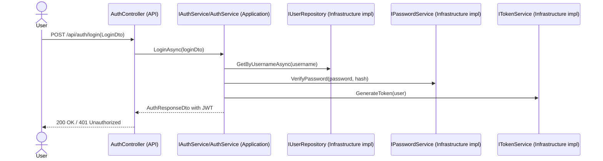
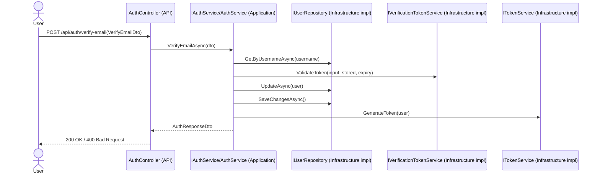

# Authentication Flow Diagram

## Registration Flow

## Login Flow

## Verify Email Flow

## Layers Involved

- Presentation layer: `MyFood.Api` controllers
- Application layer: DTOs, service interfaces, `AuthService`
- Domain layer: `ApplicationUser`
- Infrastructure layer: repositories plus password/token/email/verification implementations

## Dependency Flow

- `MyFood.Api` depends on `MyFood.Application`
- `MyFood.Application` depends on abstractions and `MyFood.Domain`
- `MyFood.Infrastructure` depends on `MyFood.Application` and `MyFood.Domain`
- Dependencies point inward toward the application/domain core
